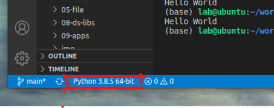

Berner Fachhochschule BFH - MAS Data Science - Graph Machine Learning - Master Thesis FS/2022 Thomas Iten

# Installation

## Uebersicht
Die Anleitung beschreibt die Schritte zur Installation von Python (mit Hilfe von Miniconda) und einer Entwicklungsumgebung (VS Code) für Linux oder Windows und umfasst folgende Punkte:
- Software (Miniconda, VS Code, GIT)
- Projekt Setup
- Häufige Befehle

Für die Ausführung des Projektes kann natürlich auch eine andere Python Installation und Entwicklungsumgebung (wie zum Beipiel PyCharm/IntelliJ) eingesetzt werden.


# Software

## Miniconda
Miniconda ist ein frei verfügbares minimales Installationsprogramm für Conda. Es ist eine kleine Bootstrap-Version von Anaconda, die nur Conda, Python und eine kleine Anzahl von gebräuchlichen Paketen (einschliesslich pip, zlib) und ein paar weitere enthält.

### Windows
1. Download und Installation von Miniconda für Python 3.8 (oder grösser):
   https://docs.conda.io/en/latest/miniconda.html

2. Einstellungen während der Installation
   - Choose an installation location or use the default proposed by Miniconda
   - Enable Checkbox: Register Miniconda as my default Python 
   - Finish Setup
   
### Linux
1. Bash starten
2. Download Installationsskript "latest":
   ```
   wget https://repo.anaconda.com/miniconda/Miniconda3-latest-Linux-x86_64.sh
   ```
3. Mode anpassen zum ausführen:
   ```
   chmod +x Miniconda3-latest-Linux-x86_64.sh
   ```
4. Start Installation:
   ```
   ./Miniconda3-latest-Linux-x86_64.sh
   ```
   <br />
   <br />
   


## Visual Studio Code
Installation und Konfiguration von Visual Studio Code.

### Windows
1. Download und Installation:
   https://code.visualstudio.com/

### Linux
1. Start Software Center und Installation: 
   "Visual Studio Code"

### Einstellungen
1. Start VS Code
2. Installation der Python Extension
   - Auf der linken Seite den Plugin Button klicken
     <br />
   - Im Suchfeld "Python" eingeben 
     <br />
   - "Python" Plugin wählen und installieren
     <br />
     Beachte: Mit dem "Python" Plugin wird auch das "Jupiter Notebook" Plugin installiert.
3. Auswahl eines Python Interpreter 
   - Tasten Kombination Ctrl+Shift+P klicken 
     <br />
   - Die Interpreter Auswahl sieht man anschliessend in der VS Code Fusszeile links
     <br />
4. Weitere Informationen siehe:
   https://code.visualstudio.com/docs/python/python-tutorial

## Git

### Windows
1. Download und Installation:
   https://git-scm.com/download/win

### Linux
1. Download und Installation:
   ```
   sudo apt install git
   ```
   

### Einstellungen
1.  Start Git Bash (Windows) oder bash (Linux)
2. Check Version:
   ```
   git -version 
   ```
3. Globale Einstellungen:
   ```
   git config --global user.name  [Name]
   git config --global user.email [E-Mail]
   ```

## Projekt Setup

1. Start Anaconda Prompt (Windows) oder bash (Linux)

2. Erstellung eines Verzeichnis zum Ablegen der Projekte
   ```
   mkdir worksapce
   ```

2. Clone Projekt
   ```
   git clone https://github.com/surfmachine/gml.git 
   ```
   Alternative kann das Projekt auch als ZIP Datei heruntergeladen und entpackt werden.
   
4. Erstellung Conda Umgebung:
   ```
   conda info --envs
   conda env create -f environment.yml
   conda activate gml
   conda list
   ```
5. Projekt im VS Code öffnen
   - File Open Folder... wählen
   - Projektverzeichins "gml" auswählen 
6. Python Umgebung im VS Code auf "gml" setzen
   - Tasten Kombination Ctrl+Shift+P klicken
   - Python: Select Interpreter wählen (ggf. im Suchfeld Python eingeben)
   - Die Interpreter Auswahl sieht man anschliessend in der VS Code Fusszeile. 
7. Falls neue Packages installiert werden sollen:
   - Package Name und Version im environment.yml eintragen
   - Dann Umgebung aktivieren und aktualisieren:
     ```
     conda info --envs
     conda activate gml
     conda env update -f .\environment.yml
     ```

## Häufige Befehle

### Conda / Miniconda

Befehle                              | Beschreibung
------------------------------------ | ----------------------------------------
conda --version                      | Show version
conda info --envs                    | Show environments
conda create -n myenv phython=3.6.2  | Create environment with given python version
conda env remove -n myenv            | Remove environment
conda activate myenv                 | Activate the myenv environment
conda list                           | Show packages of active environment
conda install [pachagename]          | Install Package
conda update [pachagename]           | Update Package 

### Conda Umgebung

Installation einer Conda Umgebung mit einer `environment.yml` Datei:
1. Git Bash oder Anaconde Prompt (Windows) oder Bash (Linux) starten
2. Wechel in den Projektordner:
   ..\workspace\myproject
3. Datei `environment.yml` öffnen und Projektname sowie alle benötigten Package angeben (wie im folgenden Besipiel):
   ```
   name: myproject
   dependencies:
     - python=3.9
     - conda==4.9.2
     - pip=20.2.4
     - pip:
         - setuptools==51.0
         - numpy==1.19.4
         - pylint
         - streamlit
   ```
4. Neue Umgebung installieren und aktivieren:
   ```
   conda info --envs
   conda env create -f .\environment.yml
   conda activate myproject
   conda list
   ```
5. Bestehende Umgebung aktivieren und aktualisieren:
   ```
   conda info --envs
   conda activate myproject
   conda env update -f .\environment.yml
   ```
6. Bestehende Umgebung aktivieren und installierte Packages anzeigen:
   ```
   conda info --envs
   conda activate myproject
   conda list
   ```

### VS Code

Befehle                              | Beschreibung
------------------------------------ | ----------------------------------------
Ctrl + Shift + P                     | Start Command Panel
Ctrl + NumPadAdd                     | Menu: View / Appereance / Zoom In
Ctrl + -                             | Menu: View / Appereance / Zoom Out

---
[Zum Hauptmenu](../README.md)